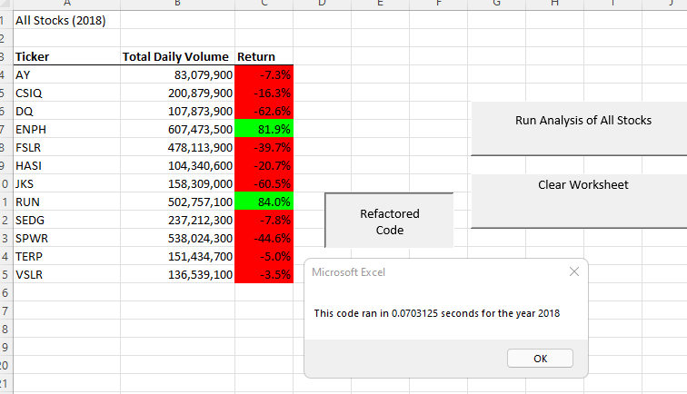

# VBA_Challenge
# Refactored All Stocks Code
## Overview of Project
Steve is helping his parents analyze stock that they have invested in by using excel, 
but he would like more details. We used VBA with excel on a stock market data set to
find out the returns of DQ stock, which Steve's parents had invested in.  We found that the stock 
had poor returns.  Steve then requested we run analysis on the rest of the stock of the 2017 and 2018 
data set to see what stocks would have better returns. To do this we needed to refactor or tweak 
the original code to loop through all the stocks and calculate opening and closing differences to 
get year end returns for each, on a separate spreadsheet. With all this data, it would take longer
to run the analysis, so the code needs also be structured to decrease the amount of time to run, 
which will be displayed by using the button function to display resulst in excel. 

## Results
For this project we needed to fulfill the following requirements thes requirements.

The tickerIndex is set equal to zero before looping over the rows.
 tickerIndex = 0
Arrays are created for tickers, tickerVolumes, tickerStartingPrices, and tickerEndingPrices.
 Dim tickerVolumes(12) As Long
    Dim tickerStartingPrices(12) As Single
    Dim tickerEndingPrices(12) As Single

The tickerIndex is used to access the stock ticker index for the tickers, tickerVolumes,
tickerStartingPrices, and tickerEndingPrices arrays

 For i = 0 To 11
    
     tickerVolumes(i) = 0
    
    Next i
   
The script loops through stock data, reading and storing all of the following values from each row: tickers, 
tickerVolumes, tickerStartingPrices, and tickerEndingPrices

For i = 2 To RowCount
tickerVolumes(tickerIndex) = tickerVolumes(tickerIndex) + Cells(i, 8).Value
 If Cells(i, 1).Value = tickers(tickerIndex) And Cells(i - 1, 1).Value <> tickers(tickerIndex) Then
         tickerStartingPrices(tickerIndex) = Cells(i, 6).Value
        
        End If
       If Cells(i, 1).Value = tickers(tickerIndex) And Cells(i + 1, 1).Value <> tickers(tickerIndex) Then
         tickerEndingPrices(tickerIndex) = Cells(i, 6).Value
        
      tickerIndex = tickerIndex + 1 
      
        End If
            
     Next i
    
  For i = 0 To 11
        
        Worksheets("All Stocks Analysis").Activate
        Cells(4 + i, 1).Value = tickers(i)
        Cells(4 + i, 2).Value = tickerVolumes(i)
        Cells(4 + i, 3).Value = tickerEndingPrices(i) / tickerStartingPrices(i) - 1
        
        
    Next i 

There are comments were included to explain the purpose of the code. 

See the images below to show that the 
The outputs for the 2017 and 2018 stock analyses in the VBA_Challenge.xlsm workbook 
match the outputs from the AllStockAnalysis in the module.
The original run time for the 2017 analysis was 0.523 seconds, while the new refacrtored
code runs in 0.07 seconds.

The original run time for the 2018 analysis was 0.484 seconds, while the new refacrtored
code runs in 0.07 seconds.

The pop-up messages showing the elapsed run time for the script are saved as VBA_Challenge_2017.png and VBA_Challenge_2018.png 
and shown below.

## Summary

### Advantages and Disadvantage of Refactoring Code

### Advantages and Disadventages of Original and Refactored VBA Script
